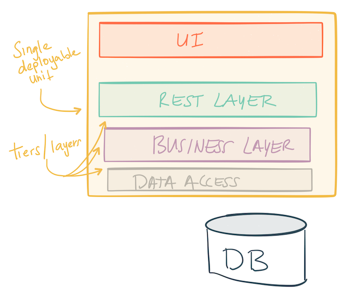
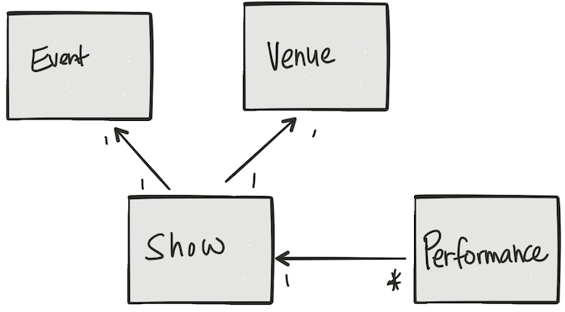
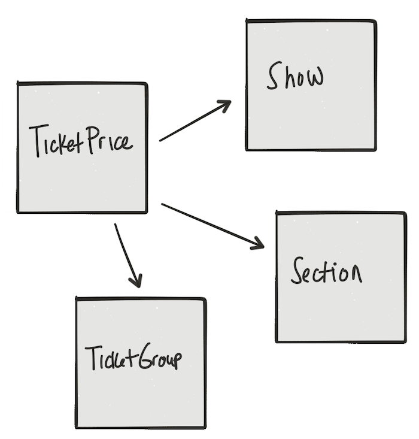
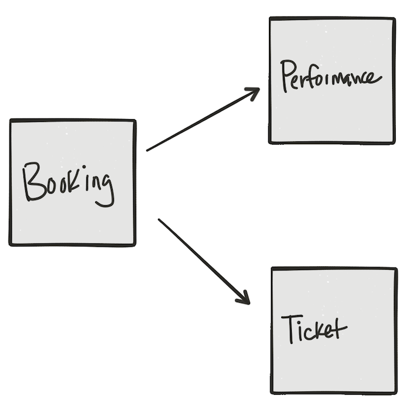

# Ticket Monster moves to microservices

At the fictitious [JBoss Ticket Monster](http://www.jboss.org/ticket-monster/) company the VPs are looking for new ways to compete in an ever-increasing competative market of online ticket sales. They've been lamenting how long it takes to make changes to their bread and butter ticket-selling website and add new features including new channels for driving ticket sales. As we as consumers become ever more connected to online networks, more opportunity for selling/buying tickets has emerged. Over the past few years, it also became more and more expensive to sustain. They want to add new features like a waitlist for tickets that aren't currently available, a rewards program for those folks who buy a lot of tickets, a recommendation engine, personalized mobile app, social integration and much more. With such a large number of developers working on the project, the complexity, technical debt, and rigidity of the application architecture, it's been difficult to coordinate how best to add this new functionality. On top of it, deployments were tricky and often caused outages. 

Ticket Broker, a new boutique startup is capturing mind share and market by integrating more closely with social platforms, offering new services through their mobile  and social TV apps, and Ticket Monster realizes they need to play catchup and at the same time harness digital innovation to compete going forward. They've decided that technology should become a core competency of their company and work much closer with the business to implement some of these new business initiatives. They're exploring things like cloud, devops and microservices, but with all of the buzz and confusion they're not quite sure what to believe and how to get started. They want to cautiously introduce technology where it fits and can benefit them. 

They're exploring ways they can:
 
* improve the developer experience for working on their systems
* scale out their large number of developers 
* speed up deployment cycles; currently they only deploy once a quarter
* automate some of their high availability concerns
* improve their confidence for deployments and not have to have "all hands on deck" in the late evening & over the weekends
* improve instrumentation and diagnostics into their systems so they can quickly identify problems/bottelnecks/failures
* implement new features faster and explore where in their architecture things may be slowing them down
* be able to experiment and run split tests / A-B tests / and counter-factual tests to guage customer interest 
* reduce the costs of running these experiments so they can quickly learn and innovate


## What to do with their existing architecture?

Ticket Monster is a successful company up to this point and they've invested a lot over the years in making their current application and its associated infrastructure work. They are interested in modernizing toward the cloud but they've struggled to figure out how to attack the problem. After some consultation they came up with a three-phase strategy:
  
### Phase I
For the first phase of their strategy for modernization, they decided they wanted to tackle some of the environment around the application before they attack the app directly. Their initial goals were simple:

* simplify and streamline the management/deployment tools for deploying their application
* take better advantage of their existing hardware investments and contain costs
* develop/improve their methodologies for reducing deployment risk and time for issue recovery
* put themselves into position to use cloud providers (perhaps multiple different ones) for commodity server/storage/network and services

  
### Phase II
For Phase II, the teams at Ticket Monster wanted to add new functionality to their applications using their new strategic platform from Phase I as a solid foundation. They decided for phase II to explore delivering new functionality using a Microservices-style approach. Some of the goals for phase II:

* Create new microservices for adding waitlist and search functionality
* Integrate it with the existing legacy application and make it appear seamless to users

In Phase II, the teams quickly ran into questions:

* What technology to use to build these new services?
* How do they decide what functionality goes into which service, and how big should these services be?
* How would they leverage existing data in their legacy services?
* How would they write services that would be better exposed for mobile devices?
* How would they secure their new services and integrate with their legacy system?
* How do they solve some of the issues that come up with a distributed system like data provenance, causal sequential interactions, latency tracing, SLA monitoring, logging, etc.
* How could they build a data pipeline for analytics, machine learning, auditing, etc


The teams looked to solve these challenges while achieving their goals for this phase all the while taking advantage of the platform they now have from Phase I. They also realized that although they'd be able to solve most of the problems from this phase, this phase is probably a constantly evolving phase as new features and functionality are added to the Ticket Master business and set of applications. In some ways, Phase II and Phase III could also proceed in parallel, though some up-front coordination would be necessary.

### Phase III

In the final Phase, the teams at Ticket Monster wanted to take a realistic view at what to do with their monolithic legacy application. They wanted to explore the benefits and tradeoffs of breaking up their monolith and what methodologies and strategies they could use if they decided to do so. Some of this would include re-writing parts of the monolith into new microservices and sunsetting the functionality in the legacy app. Another option would be to take apart the application without a re-write and focus on building the modules as services. Again, alternatively, they could just add minor enhancements to the monolith to help make it play nicer in a modern microservices architecture. Lastly, they also conceived of just keeping the monolith around but not adding any new functionality to it.  


Let's take a look at how all of this unfolded and look closely at the principles, patterns, and practices that guided some of these decisions. Also, as a part of implementing these three phases, we also look at some tools and technology to help us along. Here we go!


## Exploring the Ticket Monster application


The main Ticket Monster application, and the scenarios which we'll explore, is centered on a traditional layered Java EE application with a single backing MySQL database. 



The app was written in 2005, and that's the approach we all took back then. The application source code was stored in a SVN repository that was eventually moved to git. The source code can be found here [https://github.com/christian-posta/ticket-monster](https://github.com/christian-posta/ticket-monster)

The application uses Angular JS for the UI, JAX-RS for the backing REST services and JPA for implementing the data layers. Everything in-between was built as Java code to glue the front ends to the data. All parts of the app are packaged as a single WAR file and deployed into a Java EE server (JBoss Wildfly/EAP). Please see the official [Ticket Monster website for a more thorough introduction](http://www.jboss.org/ticket-monster/introduction/). 

If you look at the main area of the Java source code you see a package structure like this:


We'll come back to this in later sections, but these layers have proven to be part of the issue when trying to make changes to the app. We'll rely heavily on Domain Driven Design thinking and patterns to help overcome some of these issues. Before we do that, however, we want to understand the use cases that are intended to be solved with the current application and also suggest improvements to implement in the future.

### Current use cases:

#### Search and Booking
The end users of the application want to attend some cool events. They will try to find shows, create bookings, or cancel bookings. The use cases are:

* look for current events;
* look for venues;
* view, select shows (events taking place at specific venues) and choose a performance time;
* book tickets;
* view current bookings;
* cancel bookings;

#### Adminstrative
Administrators are more concerned the operation of the business. They will manage the master data: information about venues, events and shows, and will want to see how many tickets have been sold. The use cases are:

* add, remove and update events;
* add, remove and update venues (including venue layouts);
* add, remove and update shows and performances;


#### Monitor / simulation 

* monitor ticket sales for current shows and events
* simulate load


Features to think about adding:

* Top priority shows
* Search
* User profiles
* Wait List
* Discounts (coupons, gift cards)
* Loyalty
* Payment processing
* Analytics
* Recommendations
* Social (what are your friends doing)
* Fraud detection


Let's look at the current model an the way entities are represented:

* `Event` - A model that represents a sport game, stand up routine, musical performance, lecture, etc. An event is described by its name and description. An event takes place at a `Venue` and is called a `Show`. A specific date/time combination of a `Show` is called a `Performance`. When users search, they may search for an `Event` and they end up getting tickets to a `Performance`
* `Show` - an `Event` at a particular `Venue`
* `Performance` - an date/time of a particular `Show`



* `Venue` - A model element that represents a location (has an address) at which `Event`s can happen. Each `Venue` can have different layout, sections, and number of seats. 
* `Section` - A grouping of seats in a particular `Venue`. A section can have different prices for its seats based on the Show and that's captured in `TicketPrice`


* `TicketPrice` - a model capturing the price of a seat for a specific section for a specific show. Seat prices may be different depending on who sits there (adult, child) and is captured in `TicketCategory` TODO: expand on this and explain how this is probably a much more explicit domain element called "discount"



* `Booking` - associates a set of `Ticket`s with a `Performance`




* `MediaItem` - an image or video attached to the `Event` or `Venue` TODO: expand on this; this seems like too many things crammed into a single model

I've opted to not show the media items and its relationships at the moment. We can get back to it.

## Phase I

For Phase I, the project's initial phase, we want to take the assumption that the application will not have any major changes and that everything will be kept in tact as-is including the code, APIs, application server and databases. What we want to focus on in the first phase is laying the ground work and achieving small wins. Doing this in small, iterative, batches will help the teams discover and focus on the important goals without getting too distracted. Recall those important goals for the first phase:
 
 * simplify and streamline the management/deployment tools for deploying their application
 * take better advantage of their existing hardware investments and contain costs
 * develop/improve their methodologies for reducing deployment risk and time for issue recovery
 * put themselves into position to use cloud providers (perhaps multiple different ones) for commodity server/storage/network and services
 
The team decided to focus on these first principles to help guide them, and make any technology selections based firmly on how it aligns with these principles (with respect to the first phase, although positioning for the future phases is equally important)

* enable delivery of small, incremental changes
* enable safe, no-downtime deployments where possible
* enable rollback of service changes w/ no-downtime where possible
* minimize configuration drift between environments
* automate as much of the deployment mechanisms as possible
* enable service isolation and boundaries
* plan for failure of parts of the system

With the team agreeing to these first principles, they decided to implement Phase I, they'd choose to go in the direction of using Docker to help with these non-functional requirements. They wanted to focus on the concepts of immutable builds and immutable delivery.

Immutable delivery concepts help to reason about the problems that were cropping up with their old build, release, and delivery model. With immutable delivery, the team will try to move the various moving pieces (app code, configuration, environment setup, application servers, JVM, JVM dependencies, etc) into pre-baked images as part of the build process. The teams at Ticket Monster  imagined as part of their build process they could output a fully baked image with the operating system, the intended version of the JVM, the application server, and all non-environment-specific configuration. They would then have more confidence when deploying into any environment, testing it, and migrating it along toward production without worrying about "whether the environment or application is configured consistently."  As part of immutability, the teams also had to wrap their head around needing to make changes: if they needed to make a change to their application, they would rebuild the entire image into a new version with this pipeline and deliver a new version of the application. 


The teams decided that using Docker they can package their applications and configuration in a repeatable, consistent manner. With Docker, they can package all of their dependencies (including the JVM! remember, the JVM is a very important implementation detail of any application) and run them on their laptops as well as in dev/qa/production and remove some of the guessing about what's different across systems. No matter how much we try, how stringent our change process is, or what best-of-breed configuration automation, we always seem to end up with differences in the operating system, the app servers, and the databases. Docker helps ease that pain and helps us reason about a consistent software supply chain to deliver our applications. 

The original Ticket Monster application is a Java EE war file with all of the layers packaged as a single deployable. It gets deployed into a WildFly 10/EAP 7 application server and has extra notes in the JIRA tickets to configure the database connections and so forth. Our first step is to codify all of this from the WAR to the WildFly server to the JVM and all of the JVM dependencies into a single Docker container. We will continue to run the database outside of the Docker environment to begin. Later we'll come back and see how a Docker environment can help our automation of managing and upgrading the database as well. 

At first, the development team started by making their development environments (on their laptops) Docker capable. They also changed their shared Dev environment to match similarly to their laptops with Docker. They set up a Jenkins CI build to build their docker container and deploy into Dev when they had new versions. They did this as a first step to get their hands familiar with Docker and identify what type of software supply chain they would need (OS, Middleware, tooling, and eventually their code) as well as get familiar with immutable delivery principles.  But everything from QA on up to Prod was still the old way of doing things. They were off in the right direction, but still not there.


As the teams become more familiar with Docker and packaging their application and the concepts of immutability they started to run into scaling challenges. 


### Deploying self contained in openshift
 

```
mvn clean install
mkdir -p target/openshift/deployments
mv target/ticket-monster.war target/openshift/deployments/ROOT.war
cd target/openshift
```

```
oc new-build --binary=true --strategy=source --image-stream=wildfly:10.0 --name=ticket-monster-full 
oc start-build ticket-monster-full --from-dir=.
oc new-app ticket-monster-full
oc deploy ticket-monster-full
oc expose svc/ticket-monster-full
```

### deploying w/ mysql

navigate to $PROJ_ROOT/demo

```
oc create -f openshift-mysql.yml
oc process ticket-monster-mysql | oc create -f -
oc deploy mysql --latest
```

Now let's build the artifact w/ mysql as the backend in mind:

First build the app with the mysql profile:

```
mvn clean install -Pmysql-openshift
mkdir -p target/openshift/deployments
mv target/ticket-monster.war target/openshift/deployments/ROOT.war
cd target/openshift
```


```
oc new-build --binary=true --strategy=source --image-stream=wildfly:10.0 --name=ticket-monster-full --env=MYSQL_DATABASE=ticketmonster,MYSQL_USER=ticket,MYSQL_PASSWORD=monster
oc start-build ticket-monster-full --from-dir=.
oc new-app ticket-monster-full
oc deploy ticket-monster-full
oc expose svc/ticket-monster-full
```


To do Jenkins Pipelines, add the Jenkinsfile to the root of the $PROJECT_ROOT/demo folder and (need latest version of `oc` to do this)


```
oc new-build https://github.com/christian-posta/ticket-monster#monolith-master --strategy=pipeline --context-dir=demo --name=ticket-monster-pipeline
```

> we need this to allow permissions: `oc policy add-role-to-user edit system:serviceaccount:$(oc project -q):default`


BTW: to run ticket-monster-ui we should enable full access to the project to run docker containers:

> oc adm policy add-scc-to-user privileged system:serviceaccount:<proj_name>


for replication to work, we need to do this to the database:

> grant select, reload, show databases, replication slave, replication client on *.* to 'replicator' identified by 'replpass';

### Deployments
The ticket monster teams were taking good advantage of Docker for deployments but they wanted to be able to do more sophisticated things like clustering their application and ability to do blue-green deployments to move to zero-downtime deployments. See here for [more about blue-green deployments and other deployments like canary and A/B testing, etc](http://blog.christianposta.com/deploy/blue-green-deployments-a-b-testing-and-canary-releases/). They also thought initially about breaking up their services and wondered how they would discovery and load balance across each other. Since they were already using Docker, they decided the awesome [Kubernetes project](http://kubernetes.io) would help them get to a _smarter_ cluster deployment. They decided to leverage Kubernetes to deploy their application in a cluster and started to take advantage of blue-green deployments which are a native feature of Kubernetes. They ran into some issues, however. What do they do with the database? A blue-green deployment basically allows you to stand up a new version of your application alongside the existing version. Initially, it does not take any load and is hidden from clients. You can start it up, do some basic smoke tests, and when you're ready, switch over the load to the new version. The team had questions about what to do with the database?

They settled on the following approach, and it's one they would continue to use after they've split up the monolith.

* deploy the new version of the app into its own cluster (running in Docker, managed by Kubernetes). this new version of the app would have a flag in it that, if enabled, would enable the new features of the application. On this release, the flag would be disabled so as to mimic as close as possible the previous version.
* now a new version of the tables would be applied to the database. the team decided to use the awesome [Liquibase](http://liquibase.org) project to handle configuration management/schema management of the database including rollbacks if needed. an important part about this part is that the previous version of the application would be able to deal with changes of the schema as long as they were backward compatible. non-backward compatible changes would be dealt with a different way (discussed later). 
* now the new version of the application is smoke tested. this could be something like running a test with a sampler user in the database or something similar.
* now the team has two options: first they could try a blue-green deployment by changing the [kubernetes service](http://kubernetes.io/docs/user-guide/services/) that's pointing to the old version to point to the new version. this would be an all-in-one switch over to the newly deployed version and would start taking production load. the risk here would be small (although still risk) as the new version would still be running as close to the old version as possible (because the flag was not switched). if everything works fine, at this point, you can proceed to the next step. or, they would switch the kubernetes service back to point to the old version. Alternative would be to try a canary release of the new version into production and see how it responds. for this, you could easily just change the labels of one of the services to match that of the current kubernetse service. 
* at this point you can employ a rolling upgrade to enable the flag of the new version. you can use a canary strategy here as well. if everything looks good you continue to enable the new version of the service by switching the flag.

Two main takeaways from this strategy (and there are variants of it as needed):

* First, if you're doing a deployment of a service/application you may have to do it in phases as above (another approach is discussed later). You may mix a combination of blue/green, canary, and rolling upgrade 
* Although we prefer pure immutable deployments, we can make a calculated deviation by moving the upgrade along slowly with version/feature flags.

### Breaking down the monolith
Now the ticket monster teams have a system in place for deploying the existing monolith in a safe, repeatable manner including rollbacks. They use Docker containers to take advantage of immutability and packaging as they move through a deployment pipeline and use Kubernetes to manage the cluster including rolling-upgrades, blue-green deployments, canary releases, starting/stopping pods, etc. Now they need to explore how best to break up the application.

Ideally we end up with autonomous services that own their entire vertical of the system. This includes User Interface components, service/domain components, and choice of backend persistence. But first iteration, they will try to break the UI components as a complete layer out of the monolith. Layers are not the goal, but they can be an intermediate step. If you take a look at the [Ticket Monster UI project](https://github.com/christian-posta/ticket-monster-ui) you'll see we've done just that. We even took the UI layer and put them into a http server complete with a forward proxy (httpd in this case). We did this for two reasons:

* We don't need to run the UI in a Java EE server since it's just a static set of JS/CSS/HTML resources
* We want to be able to use a forwarding proxy to obscure the actual locations of the would-be microservices in the backend.

Now with the forward proxy in place, we can not only hide the backend microservices that we'll build out, but we can side step having to enable [CORS](https://en.wikipedia.org/wiki/Cross-origin_resource_sharing) on everything and also keep the security implementation a little simpler. We'll get to security later. 

The UI gets deployed as a Docker container inside of Kubernetes. The forwarding proxy will eventually map calls to backend microservices to the internal Kubernetes DNS name. For example:

.....put example here......


#### Determinig the boundaries

We split out a single layer of our application into a "UI" service, but that's the last layer we create. We want to create [verticals or self-contained systems](http://blog.christianposta.com/microservices/carving-the-java-ee-monolith-into-microservices-perfer-verticals-not-layers/) instead of layers. These SCSs will own their own database and their own service layers. So how do we go about breaking up the application.

For most enterprise applications, we will want to focus our boundaries around the [DDD concept of Bounded Context](http://martinfowler.com/bliki/BoundedContext.html). It's imperative that we don't just start breaking out services into "smaller" services based on technical function or some ambiguous metric like lines of code. It's absolutely paramount that we split our application into boundaries guided by the domain. Note, you may  not see the internet companies doing this as fastidiously. There's a good reason: they don't know about DDD. They don't care about it. Their domains, mostly, are quite simple. They deal with a different problem: that of scale. Posting tweets to twitter is an insanely simple "domain". You don't need DDD for that. Posting tweets from 100s of millions of users and trying to deduce the twitter "follower" stream for all those users is crazy complicated. But enterprises will have to deal with complexity in the domain _as well as_ potentially scale. Don't overlook the importance of modeling the domain as a way to prepare for performance and scale. They're both highly intertwined. 
